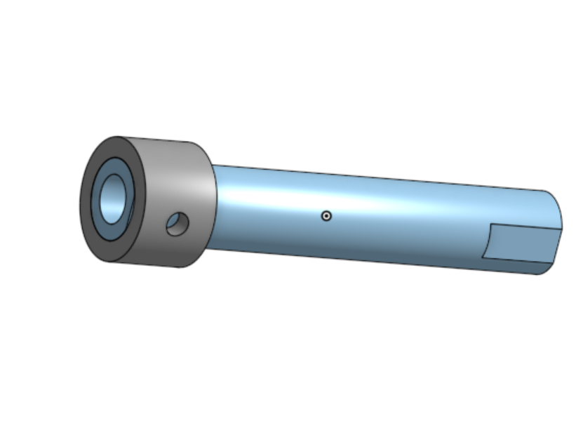
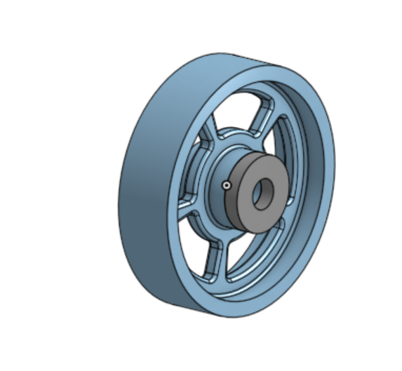
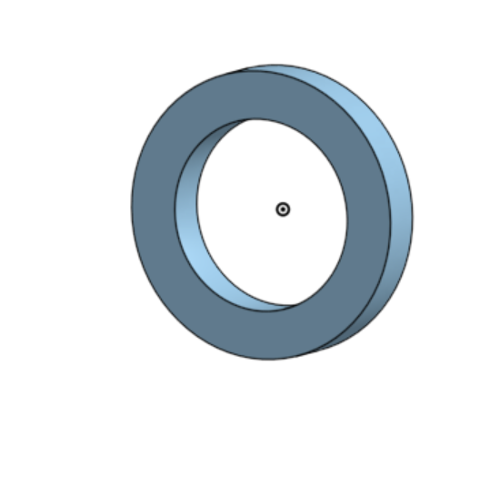
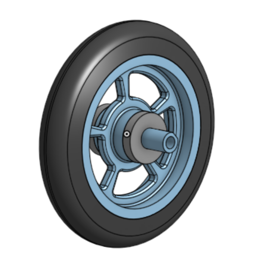

# Basic_Onshape_CAD

## Caster Base

It was fun to actually start doing some CAD and messing around with all of the different tools and features!

https://cvilleschools.onshape.com/documents/3e74296bc327d1fba3616e2e/w/395f1dc6eb1defe881c951d6/e/d78d00db6e33c7b0fbdabf87

## Caster Mount

I am starting to figure out more of the Onshape tools, whereas before I was mostly just following the tutorial. It's nice to feel like I can actually do stuff, and to actually understand what I am doing.

Onshape Link: https://cvilleschools.onshape.com/documents/3e74296bc327d1fba3616e2e/w/395f1dc6eb1defe881c951d6/e/d78d00db6e33c7b0fbdabf87

## Caster Fork

I am having a lot of fun with Onshape! It is cool to start making more advanced things, though I am a bit intimidated by the wheel.

Onshape Doc: https://cvilleschools.onshape.com/documents/3e74296bc327d1fba3616e2e/w/395f1dc6eb1defe881c951d6/e/c696d5bce44de5e508c743fb

## Caster Tire

That "Revolve" tool is like magic! It's awesome to get a small look at all of the crazy things you can do with Onshape. 

Document: https://cvilleschools.onshape.com/documents/3e74296bc327d1fba3616e2e/w/395f1dc6eb1defe881c951d6/e/7ab34174e77ac61fae9f7070

## Caster Wheel

I was a little bit scared of this one, but it didn't end up being that bad. I'm excited to start actually putting this thing together!

Document: https://cvilleschools.onshape.com/documents/3e74296bc327d1fba3616e2e/w/395f1dc6eb1defe881c951d6/e/eeafc942455569a6a76c8ddc

## Caster Axle, Collar, and Bearings

Again, I'm so ready to start the assembly. I can't wait to see all of this come together in one big thing!

[Onshape](https://cvilleschools.onshape.com/documents/3e74296bc327d1fba3616e2e/w/395f1dc6eb1defe881c951d6/e/e7a1acd2b5bfa23757ab1f50)

## Caster Sub-Assembly

It was so fun to start putting things together! It is amazing how easy Onshape makes it to assemble your projects.

[Onshape Link](https://cvilleschools.onshape.com/documents/3e74296bc327d1fba3616e2e/w/395f1dc6eb1defe881c951d6/e/8794be0736bcc05e11dcb0e5)

## Caster Final Assembly

I can't believe we are done with the caster! It was so cool to see all of the parts we have been working on all working together.

[Onshape](https://cvilleschools.onshape.com/documents/3e74296bc327d1fba3616e2e/w/395f1dc6eb1defe881c951d6/e/eea73beb2a465187bf4fca33)
